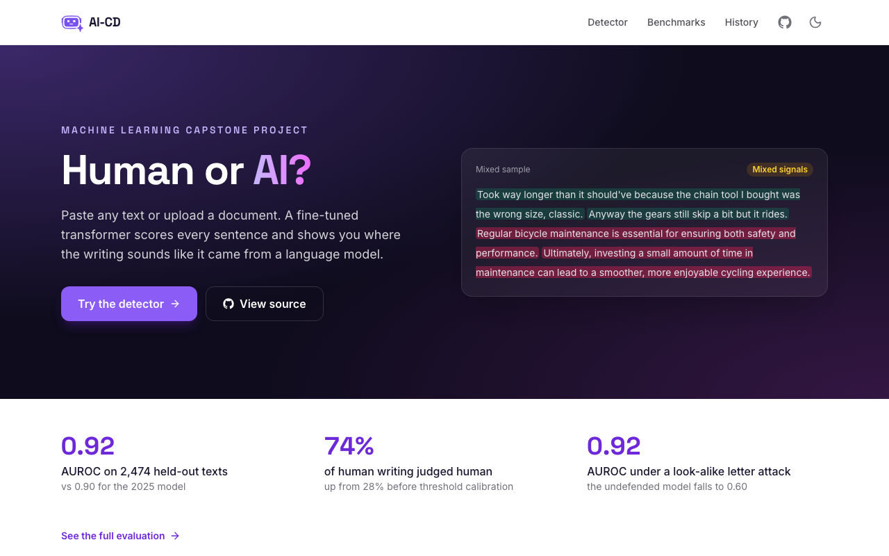
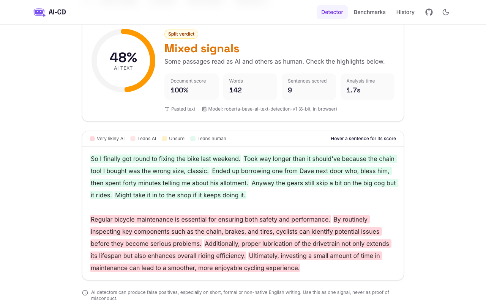
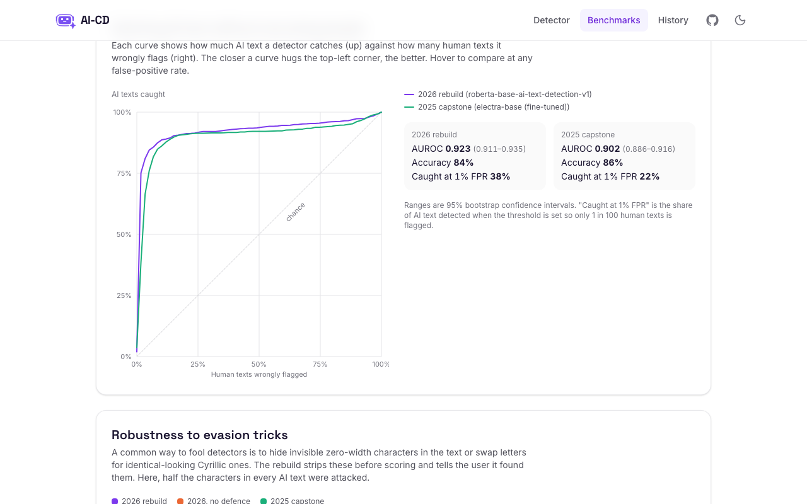
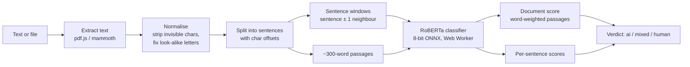

<div align="center">


# AI Content Detector

**Paste text or upload a document and see, sentence by sentence, how likely it is to be AI-generated. The model runs entirely in your browser.**

[**Live demo**](https://aicd-nine.vercel.app) · [Benchmarks](https://aicd-nine.vercel.app/benchmarks) · [Model on Hugging Face](https://huggingface.co/ZubairElliot17/aicd-roberta-onnx) · [How it works](#how-it-works)

[](https://github.com/Zubair-Elliot-17/AI-CD/actions/workflows/ci.yml)




 

</div>

## Why this project matters

Schools and employers already use AI detectors to decide whether someone cheated. When a detector is wrong, a real person gets accused of something they didn't do, and most tools publish no evidence of how often that happens. This project treats that as the main engineering problem, not an afterthought.

- **It is measured, not asserted.** Every claim in this README comes from a reproducible benchmark of 2,474 texts that the model never saw in training, from 11 different LLMs plus human writers in the same domains. The scripts and raw numbers are in [`backend/eval/`](backend/eval).
- **The measurements changed the product.** The benchmark exposed three real problems: a trivial character-swap attack that made the detector no better than a coin flip, verdict logic that called 63% of genuine human writing "mixed", and a persuasive-essay domain where 39% of human texts get flagged. The first two were fixed, and the third is published as a known limitation.
- **False accusations are the metric that matters most.** Verdict cut-offs are chosen to keep human writing called "AI" under 5% on a separate calibration set, and when unsure the app says "mixed" instead of guessing. On held-out data the live site calls 4.5% of human texts AI.
- **It costs nothing to run and keeps text private.** The model runs inside the visitor's browser, so there is no server bill, no cold start, and the text being checked is never uploaded.
- **It is built like production software.** Typed Python and TypeScript, 60 automated tests, a test that keeps the Python and TypeScript pipelines identical, CI on every pull request, a protected `main` branch, and automatic deploys.

**Skills shown:** applied NLP (transformer inference, evaluation with AUROC and bootstrap confidence intervals, threshold calibration), adversarial robustness, model optimisation (ONNX export, 8-bit quantization), browser engineering (Web Workers, WebAssembly, cross-origin isolation), full-stack TypeScript/React and Python/FastAPI, and CI/CD.

## About

AI-CD started as our final-year **CSC3003S capstone at the University of Cape Town (2025)**, built by team JackBoys:

- **Meekaaeel Booley**
- **Mubashir Dawood**
- **Zubair Elliot**

The original version used a fine-tuned ELECTRA model behind a Flask API on AWS EC2, with a React frontend on AWS Amplify. In 2026 the project was rebuilt:

| | 2025 capstone | 2026 rebuild |
|---|---|---|
| Model | ELECTRA, fine-tuned in [`ModelTrainer/`](ModelTrainer/fine_tuning.ipynb) | RoBERTa-base trained on modern LLM output ([Fakespot](https://huggingface.co/fakespot-ai/roberta-base-ai-text-detection-v1)) |
| Inference | Flask API on a server, one model call per sentence | In the browser: 8-bit ONNX model in a Web Worker, batched ([transformers.js](https://huggingface.co/docs/transformers.js)) |
| API | Flask, SQLite sessions, shared API key | FastAPI, stateless, typed schemas, rate limiting (optional; same pipeline) |
| Frontend | React + JS, MUI, Storybook | React 19 + TypeScript, Tailwind v4, dark mode |
| History | Stored on the server | Stored only in the user's browser |
| Hosting | EC2 + Amplify | Static site on Vercel, model weights on the Hugging Face Hub. No server to run or pay for |
| Quality | Manual testing | Pytest + Vitest, ruff + ESLint, GitHub Actions CI |
| Evaluation | Random split of the training data | Held-out public benchmark, attack tests, calibrated thresholds |

## Results

Both versions were scored on the same **2,474 texts** that neither was trained on: 1,400 from 11 LLMs (GPT-4o, GPT-4, Claude 1.3 to 3 Opus, Llama 3, Gemma 2, Mixtral) and 1,074 human texts from the same domains. Full charts are on the [Benchmarks page](https://aicd-nine.vercel.app/benchmarks), and the raw numbers are in [`backend/eval/results.json`](backend/eval/results.json).

| | 2025 capstone (ELECTRA) | 2026 model, no defence | **2026 rebuild** |
|---|---|---|---|
| AUROC, clean text | 0.902 | 0.923 | **0.923** |
| AI caught when 1% of human text is flagged | 22% | 38% | **38%** |
| AUROC, zero-width-space attack | 0.903 | 0.755 | **0.923** |
| AUROC, look-alike letter attack | 0.835 | 0.596 | **0.923** |
| Human texts flagged as AI | 14% | 10% | **10%** |

**The browser model.** The live site runs an 8-bit quantized copy of the model so it downloads 125 MB instead of 500 MB. Quantizing nudges scores up a little, so it gets its own verdict cut-offs, tuned the same way on the calibration set (`python -m eval.calibrate --onnx DIR`, [`calibration_q8.json`](backend/eval/calibration_q8.json)). [`eval/onnx_check.py`](backend/eval/onnx_check.py) re-scores the test set with it ([`onnx.json`](backend/eval/onnx.json)):

| | PyTorch (full precision) | 8-bit, original cut-offs | **8-bit, own cut-offs (live site)** |
|---|---|---|---|
| AUROC, clean text | 0.923 | 0.922 | **0.922** |
| Human texts judged human | 74% | 70% | **74%** |
| Human texts called AI | 6.9% | 8.8% | **4.5%** |
| AI texts called AI | 68% | 70% | **69%** |
| Mixed documents called mixed | 75% | 80% | **85%** |

Three things came out of building the benchmark:

1. **The new model was easy to fool.** Hiding zero-width spaces in AI text, or swapping half its letters for identical-looking Cyrillic ones, dropped it to near chance (AUROC 0.60). The API now strips invisible characters and maps look-alikes back to Latin before scoring, which restores the clean-text score of 0.923, and it tells the user when it finds them.
2. **The verdict logic was miscalibrated.** The sentence-level "mixed" check called 63% of human writing mixed. Thresholds are now tuned by [`eval/calibrate.py`](backend/eval/calibrate.py) on a separate calibration set from a different data split. On the test set, human texts judged human went from 28% to 74%, and human texts called AI fell from 8.8% to 6.9%. The cost is that more AI text now gets the cautious "mixed" verdict (68% of AI text is called AI, down from 80%).
3. **Persuasive essays are the hardest case.** 39% of the human-written persuasive essays are flagged. They were written by crowdworkers in 2023, when many crowdworkers were already using LLMs, so some of those labels may be wrong. They're reported anyway.

## Features

- **Sentence-level highlights.** Each sentence is shaded by its AI score. Hover one to see its score.
- **Mixed-content detection.** A human essay with a pasted-in AI paragraph is flagged as *mixed* instead of being averaged away (75% of such documents on the benchmark).
- **Evasion detection.** Zero-width characters and Cyrillic/Greek look-alike letters are removed before scoring, and the result says how many were found.
- **Runs on your device.** The detector is an 8-bit ONNX export of the model (125 MB, cached after the first visit) running on WebAssembly in a Web Worker, multi-threaded thanks to cross-origin isolation. Text never leaves the browser, and there is no cold start.
- **File uploads.** PDF (pdf.js), DOCX (mammoth) and plain text, parsed in the browser.
- **Private.** Nothing is uploaded. History lives in `localStorage`.

## How it works

The pipeline is written twice and kept in step: in TypeScript for the browser ([`frontend/src/lib/engine/`](frontend/src/lib/engine)) and in Python for the API and the benchmark ([`backend/app/`](backend/app)). [`parity.test.ts`](frontend/src/lib/engine/parity.test.ts) replays outputs recorded from the Python code (normalisation, sentence splitting, markdown cleaning and verdicts) and fails if the two drift apart.



1. **Normalise.** Invisible characters are removed, the text is NFKC-normalised, and Cyrillic/Greek look-alikes inside Latin words are mapped back. Genuine Russian or Greek text is left alone.
2. **Split.** A regex splitter that knows about abbreviations (`Dr.`, `e.g.`, `U.S.`) produces sentence spans with character offsets, so highlights map back onto the original text exactly, line breaks included.
3. **Score.** Each sentence is scored together with its neighbours, because single short sentences are too noisy to classify alone. The text is also split into ~300-word passages (the model's sweet spot under its 512-token limit) for the document-level score.
4. **Classify.** Everything goes through the model in batches sorted by length, so little compute is spent on padding. In the browser a typical 70–250-word text takes about 1–2 seconds on a laptop.
5. **Verdict.** The document score sets the verdict (≥ 95% AI, ≤ 50% human, in between is mixed). If 35–65% of the words sit in sentences scoring ≥ 99%, the verdict becomes **mixed**. The model's scores bunch up near 0 and 1, which is why the calibrated cut-offs sit high.

> AI detectors are probabilistic and produce false positives, especially on short, formal or non-native English writing. Treat results as one signal, never as proof.

## Running the model in the browser

The live site has no backend. The detector runs on the visitor's own machine, which needed three things: a model small enough to download, a runtime that can execute it in a web page, and proof that the smaller model still gives the same answers.

### Why quantize

The detector is RoBERTa-base, a transformer with about 125 million parameters. Stored normally, each parameter is a 32-bit floating-point number (4 bytes), so the weights alone are about **500 MB**. That is too much to ask a visitor to download before they can paste a paragraph, and it is a lot of memory for a phone browser tab.

**Quantization** stores each weight as an 8-bit integer (1 byte) instead, plus a scale factor per tensor that maps the integers back to approximately the original values. That cuts the model to **125 MB**, a quarter of the size. Integer matrix multiplication is also faster than floating-point on CPUs and in WebAssembly, which is where browser inference runs.

This project uses *dynamic* quantization (ONNX Runtime's `quantize_dynamic`, unsigned 8-bit weights). The weights are quantized once, ahead of time. The activations, the numbers that flow between layers for a particular input, are quantized on the fly for each input. That needs no calibration data and suits transformer models, whose activation ranges vary a lot from one input to the next.

### How it was built

1. **Export to ONNX.** The PyTorch model was converted with Hugging Face Optimum to ONNX, a framework-neutral model format that can run outside Python.
2. **Quantize.** ONNX Runtime turned the 500 MB fp32 file into the 125 MB 8-bit file. Both are published at [`ZubairElliot17/aicd-roberta-onnx`](https://huggingface.co/ZubairElliot17/aicd-roberta-onnx), so they are served from Hugging Face's CDN for free and cached by the browser after the first visit.
3. **Run it in a Web Worker.** [transformers.js](https://huggingface.co/docs/transformers.js) loads the model with ONNX Runtime Web (WebAssembly) in a [Web Worker](frontend/src/lib/engine/worker.ts), so the page stays responsive while it computes. Inputs are batched and sorted by length, as on the server, so little work is wasted on padding.
4. **Unlock multi-threading.** WebAssembly threads need `SharedArrayBuffer`, which browsers only allow on *cross-origin isolated* pages. [`vercel.json`](frontend/vercel.json) sends the `Cross-Origin-Opener-Policy` and `Cross-Origin-Embedder-Policy` headers that enable it, so inference can use every core. A typical text takes about 1 to 2 seconds on a laptop.
5. **Port the pipeline.** Sentence splitting, the anti-evasion normalisation, markdown cleaning and the verdict logic were rewritten in TypeScript ([`frontend/src/lib/engine/`](frontend/src/lib/engine)). A [parity test](frontend/src/lib/engine/parity.test.ts) replays outputs recorded from the Python code, so the two versions cannot quietly drift apart.

### What quantization cost, and the fix

Rounding every weight to one of 256 values introduces small errors. Rankings barely changed: AUROC was 0.922 against 0.923 at full precision, which is within the confidence interval. But the scores came out slightly higher on average, and the verdict cut-offs had been tuned on the full-precision model. On a 500-text sample about 1% of texts crossed the 0.95 "AI" line, and on the full test set the share of human writing called AI rose from 6.9% to **8.8%**. For a tool that might be used to accuse someone, that regression mattered.

The fix was to treat the 8-bit model as a model in its own right and **re-tune its cut-offs** with the same procedure and the same separate calibration set: `python -m eval.calibrate --onnx DIR`, which writes [`calibration_q8.json`](backend/eval/calibration_q8.json). The search keeps only settings that call at most 5% of the calibration set's human texts AI, then picks the one with the highest average accuracy across human, AI and mixed texts. The chosen cut-offs (AI at a document score of 0.99 or higher, human at 0.7 or lower, AI sentences at 0.95 or higher) were then checked once on the untouched test set:

| On the 2,474-text test set | Full precision | 8-bit, old cut-offs | **8-bit, own cut-offs (live)** |
|---|---|---|---|
| Human writing called AI | 6.9% | 8.8% | **4.5%** |
| Human writing judged human | 74% | 70% | **74%** |
| AI writing called AI | 68% | 70% | **69%** |

So the browser model ends up with fewer false accusations than the original, and it catches the same share of AI text. The FastAPI backend still runs the full-precision model with its own cut-offs. [`eval/onnx_check.py`](backend/eval/onnx_check.py) reproduces this table.

## Project structure

```
backend/          FastAPI service
  app/
    main.py       routes, CORS, rate limiting, app factory
    analysis.py   sentence splitting, scoring, verdict logic
    detector.py   Hugging Face model wrapper (swappable via a Protocol)
    normalize.py  evasion defence: invisible characters and look-alike letters
    files.py      PDF / DOCX / TXT extraction
  eval/           benchmark: dataset builder, attacks, runner, threshold calibration
  tests/          pytest suite (uses a fake detector, so no model download)
  Dockerfile      model weights baked in for fast cold starts
frontend/         React 19 + TypeScript + Tailwind v4 (Vite)
  src/pages/      Home, Detect, Benchmarks, History
  src/lib/engine/ in-browser detector: normalise, split, Web Worker model, verdicts
  src/lib/        API client, localStorage history store
ModelTrainer/     original 2025 ELECTRA fine-tuning notebook
docs/             original 2025 capstone report
scripts/          parity fixture generator, Hugging Face Space deploy script
```

## Running locally

You'll need Node 22+, plus [uv](https://docs.astral.sh/uv/) for the backend.

```bash
# Web app on http://localhost:5173. The model runs in the browser, so this is all you need.
cd frontend
npm install
npm run dev

# Optional: the API on http://127.0.0.1:8000 (docs at /docs). The first run downloads the ~500 MB model.
# Start the web app with VITE_API_URL=http://127.0.0.1:8000 to use it instead of the browser model.
cd backend
uv sync
uv run uvicorn app.main:app --reload
```

Tests and linting:

```bash
cd backend && uv run pytest && uv run ruff check .
cd frontend && npm test && npm run lint && npm run build
```

### Reproducing the benchmark

The datasets are downloaded from Hugging Face rather than committed (the persuasion set is CC BY-NC-SA). The 2025 ELECTRA checkpoint is in the original repo's Git LFS history.

```bash
cd backend
uv run --group eval python -m eval.build       # test + calibration sets, ~250 MB download
uv run --group eval python -m eval.calibrate   # grid-search verdict thresholds (calibration set only)
uv run --group eval python -m eval.run --electra path/to/electra-checkpoint

# The browser's 8-bit model: tune its own cut-offs, then score the test set with it.
# DIR holds model_quantized.onnx and the tokenizer files from the Hugging Face repo.
uv run --group eval python -m eval.calibrate --onnx DIR
uv run --group eval python -m eval.onnx_check DIR
```

`eval.run` writes `eval/results.json` and the copy the Benchmarks page imports. It takes about 25 minutes on an M-series Mac.

### Configuration

Backend settings come from `AICD_*` environment variables (see [`backend/.env.example`](backend/.env.example)):

| Variable | Default | |
|---|---|---|
| `AICD_MODEL_ID` | `fakespot-ai/roberta-base-ai-text-detection-v1` | Any HF sequence classifier with an `AI` label |
| `AICD_CORS_ORIGINS` | localhost dev ports | JSON list |
| `AICD_CORS_ORIGIN_REGEX` | none | e.g. `https://.*\.vercel\.app` |
| `AICD_RATE_LIMIT_PER_MINUTE` | `30` | Per client IP, `0` disables |
| `AICD_MAX_CHARS` | `50000` | |

The frontend reads `VITE_API_URL` at build time. Leave it unset to run the model in the browser.

## API

| Method | Path | Body | |
|---|---|---|---|
| `GET` | `/api/health` | | Model status and limits |
| `POST` | `/api/detect` | `{"text": "..."}` | Analyse text |
| `POST` | `/api/detect/file` | multipart `file` | Analyse a PDF / DOCX / TXT / MD |

```bash
curl -X POST http://127.0.0.1:8000/api/detect \
  -H 'Content-Type: application/json' \
  -d '{"text": "Paste at least ten words of text here to see how the detector scores it."}'
```

## Continuous integration

Every pull request, and every push to `main`, runs [`.github/workflows/ci.yml`](.github/workflows/ci.yml) on GitHub Actions. It has two jobs that run in parallel:

| Job | Step | What it catches |
|---|---|---|
| `backend` | `uv sync --frozen` | Installs exactly the versions in `uv.lock`, and fails if the lockfile is out of date, so CI and local runs use identical dependencies. |
| | `ruff check` | Lint errors such as unused imports, undefined names and likely bugs. |
| | `ruff format --check` | Code that isn't formatted, so style never comes up in review. |
| | `pytest` | 34 tests covering the API routes, file parsing, rate limiting, sentence splitting, verdict logic and the evasion defence. |
| `frontend` | `npm ci` | A clean install from `package-lock.json`. |
| | `npm run lint` | ESLint, including React hooks rules. |
| | `npm test` | 26 Vitest tests, including the Python/TypeScript parity test and the full detect flow with the model mocked. |
| | `npm run build` | TypeScript type errors (`tsc -b`) and anything that would break the production bundle. |

Vercel also builds a **preview deployment** for every pull request, so a change can be tried in a real browser before it is merged.

**Why the tests use a fake model.** The pytest suite swaps in a fake detector with fixed scores, and the frontend tests mock the inference engine. CI therefore never downloads the 500 MB model, finishes in under a minute, and fails only when the *code* is wrong, not when the network is slow. Model quality is a separate question, answered by the benchmark scripts in [`backend/eval/`](backend/eval). They take 15 to 25 minutes, so they run by hand whenever the model or the cut-offs change, and their results are committed next to them.

**Why the parity test matters.** The detection pipeline exists twice, in Python for the API and benchmark and in TypeScript for the browser. If they drifted, the benchmark numbers in this README would describe a different system from the one on the website. [`scripts/parity_fixture.py`](scripts/parity_fixture.py) records Python's output for tricky inputs (abbreviations, homoglyphs, invisible characters, markdown), and CI fails if the TypeScript version gives a different answer for any of them.

**Branch protection.** `main` only changes through pull requests, and a pull request can only merge once both jobs pass on a branch that is up to date with `main`. The rule applies to admins too, and force-pushes and deleting `main` are blocked. Combined with Vercel's GitHub integration, which deploys `main` to production on every merge, the live site only ever runs code that has passed CI.

## Deployment

- **Web app:** a static site on Vercel (root directory `frontend/`). Merges to `main` deploy to production automatically, and pull requests get preview URLs. [`vercel.json`](frontend/vercel.json) sets the cross-origin isolation headers that let ONNX Runtime use several threads.
- **Model:** [`ZubairElliot17/aicd-roberta-onnx`](https://huggingface.co/ZubairElliot17/aicd-roberta-onnx) on the Hugging Face Hub, exported with Optimum and quantized with ONNX Runtime. [`eval/onnx_check.py`](backend/eval/onnx_check.py) re-scores the benchmark with it.
- **API (optional):** the backend's Dockerfile runs anywhere that takes a container. `scripts/deploy_space.py` and `deploy-backend.yml` push it to a Hugging Face Docker Space, which now needs a PRO account.

## Acknowledgements

- Benchmark data: [Anthropic/persuasion](https://huggingface.co/datasets/Anthropic/persuasion) (CC BY-NC-SA 4.0) and the [COLING 2025 MGT shared task](https://huggingface.co/datasets/Jinyan1/COLING_2025_MGT_en). Attacks follow [RAID](https://github.com/liamdugan/raid) (Dugan et al., 2024).
- Detection model: [fakespot-ai/roberta-base-ai-text-detection-v1](https://huggingface.co/fakespot-ai/roberta-base-ai-text-detection-v1) (Apache-2.0), from Mozilla's Fakespot team ([ApolloDFT](https://github.com/FakespotAILabs/ApolloDFT)).
- Built for CSC3003S at the University of Cape Town.
