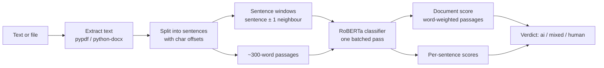

<div align="center">


# AI Content Detector

**Paste text or upload a document and see, sentence by sentence, how likely it is to be AI-generated.**

[**Live demo**](https://aicd.vercel.app) · [API docs](https://zubair-elliot-17-aicd-api.hf.space/docs) · [How it works](#how-it-works)

[](https://github.com/Zubair-Elliot-17/AI-Content-Detector/actions/workflows/ci.yml)


</div>

## About

AI-CD started as our final-year **CSC3003S capstone at the University of Cape Town (2025)**, built by team JackBoys:

- **Meekaaeel Booley**
- **Mubashir Dawood**
- **Zubair Elliot**

The original version used a fine-tuned ELECTRA model behind a Flask API on AWS EC2, with a React frontend on AWS Amplify. In 2026 the project was rebuilt:

| | 2025 capstone | 2026 rebuild |
|---|---|---|
| Model | ELECTRA, fine-tuned in [`ModelTrainer/`](ModelTrainer/fine_tuning.ipynb) | RoBERTa-base trained on modern LLM output ([Fakespot](https://huggingface.co/fakespot-ai/roberta-base-ai-text-detection-v1)) |
| API | Flask, SQLite sessions, shared API key | FastAPI, stateless, typed schemas, rate limiting |
| Inference | One model call per sentence | All sentences and passages in one batched pass |
| Frontend | React + JS, MUI, Storybook | React 19 + TypeScript, Tailwind v4, dark mode |
| History | Stored on the server | Stored only in the user's browser |
| Hosting | EC2 + Amplify | Hugging Face Spaces (Docker) + Vercel |
| Quality | Manual testing | Pytest + Vitest, ruff + ESLint, GitHub Actions CI |

## Features

- **Sentence-level highlights.** Each sentence is shaded by its AI score. Hover one to see its score.
- **Mixed-content detection.** A human essay with a pasted-in AI paragraph is flagged as *mixed* instead of being averaged away.
- **File uploads.** PDF, DOCX, TXT and Markdown, parsed in memory.
- **Private.** The API stores nothing. History lives in `localStorage`.
- **Handles cold starts.** The UI polls the API and shows when the free-tier server is waking up.

## How it works



1. **Split.** A regex splitter that knows about abbreviations (`Dr.`, `e.g.`, `U.S.`) produces sentence spans with character offsets, so highlights map back onto the original text exactly, line breaks included.
2. **Score.** Each sentence is scored together with its neighbours, because single short sentences are too noisy to classify alone. The text is also split into ~300-word passages (the model's sweet spot under its 512-token limit) for the document-level score.
3. **Classify.** Everything goes through the model in one batched forward pass. A 5,700-word document takes about 4 seconds on a laptop CPU.
4. **Verdict.** The document score sets the verdict (≥ 70% AI, ≤ 30% human). If a clear share of the words (20–80%) sits in AI-leaning sentences, the verdict becomes **mixed**.

> AI detectors are probabilistic and produce false positives, especially on short, formal or non-native English writing. Treat results as one signal, never as proof.

## Project structure

```
backend/          FastAPI service
  app/
    main.py       routes, CORS, rate limiting, app factory
    analysis.py   sentence splitting, scoring, verdict logic
    detector.py   Hugging Face model wrapper (swappable via a Protocol)
    files.py      PDF / DOCX / TXT extraction
  tests/          pytest suite (uses a fake detector, so no model download)
  Dockerfile      model weights baked in for fast cold starts
frontend/         React 19 + TypeScript + Tailwind v4 (Vite)
  src/pages/      Home, Detect, History
  src/lib/        API client, localStorage history store
ModelTrainer/     original 2025 ELECTRA fine-tuning notebook
scripts/          Hugging Face Space deploy script
```

## Running locally

You'll need [uv](https://docs.astral.sh/uv/) and Node 22+.

```bash
# API on http://127.0.0.1:8000 (docs at /docs). The first run downloads the ~500 MB model.
cd backend
uv sync
uv run uvicorn app.main:app --reload

# Web app on http://localhost:5173
cd frontend
npm install
npm run dev
```

Tests and linting:

```bash
cd backend && uv run pytest && uv run ruff check .
cd frontend && npm test && npm run lint && npm run build
```

### Configuration

Backend settings come from `AICD_*` environment variables (see [`backend/.env.example`](backend/.env.example)):

| Variable | Default | |
|---|---|---|
| `AICD_MODEL_ID` | `fakespot-ai/roberta-base-ai-text-detection-v1` | Any HF sequence classifier with an `AI` label |
| `AICD_CORS_ORIGINS` | localhost dev ports | JSON list |
| `AICD_CORS_ORIGIN_REGEX` | none | e.g. `https://.*\.vercel\.app` |
| `AICD_RATE_LIMIT_PER_MINUTE` | `30` | Per client IP, `0` disables |
| `AICD_MAX_CHARS` | `50000` | |

The frontend reads `VITE_API_URL` at build time.

## API

| Method | Path | Body | |
|---|---|---|---|
| `GET` | `/api/health` | | Model status and limits |
| `POST` | `/api/detect` | `{"text": "..."}` | Analyse text |
| `POST` | `/api/detect/file` | multipart `file` | Analyse a PDF / DOCX / TXT / MD |

```bash
curl -X POST https://zubair-elliot-17-aicd-api.hf.space/api/detect \
  -H 'Content-Type: application/json' \
  -d '{"text": "Paste at least ten words of text here to see how the detector scores it."}'
```

## Deployment

- **Backend:** a Docker [Hugging Face Space](https://huggingface.co/docs/hub/spaces-sdks-docker) (free CPU tier). `.github/workflows/deploy-backend.yml` redeploys it when `backend/` changes on `main`. It needs an `HF_TOKEN` secret and an `HF_SPACE` variable. `keepalive.yml` pings it daily so it doesn't go to sleep.
- **Frontend:** Vercel, root directory `frontend/`, with `VITE_API_URL` pointing at the Space.

## Acknowledgements

- Detection model: [fakespot-ai/roberta-base-ai-text-detection-v1](https://huggingface.co/fakespot-ai/roberta-base-ai-text-detection-v1) (Apache-2.0), from Mozilla's Fakespot team ([ApolloDFT](https://github.com/FakespotAILabs/ApolloDFT)).
- Built for CSC3003S at the University of Cape Town.
